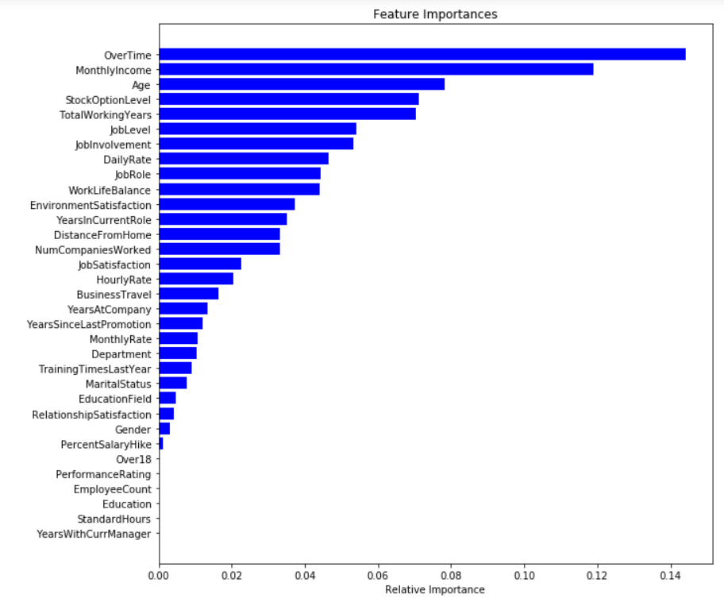

# EmployeeChurn_Analysis_and_Prediction
Employee Churn Analysis, Feature Importance and Prediction Using Ensembling Model

## What is employee churn?

Employee churn is the overall turnover in an organization's staff as existing employees leave and new ones are hired. Alternatively, in simple words, you can say, when employees leave the organization is known as churn. Another definition can be when a member of a population leaves a population, is known as churn.

## Project Description

This project focuses on analysis and prediction of employee churn data through exploratory visualization based on key indicators essential for employees. The project will cover the following topics:
> 1. Data Loading and pre-processing
> 2. Exploratory Visualization
> 3. Understanding Features and their importance
> 4. Building Ensembling Model
> 5. Evaluating Model Performance
 
## Terminologies

**Ensemble Method:**

Ensemble is a machine learning technique that combines the decisions from multiple models to improve the overall performance. There are various types of ensembling techniques, in our case we have used Bagging(Bootstrap Aggregating) ensemble method. In this method, the result from different models exposed to the datasets are aggregated to yield the final prediction.

**Label Encoding:**

Label encoding is the technique to deal with categorical values or multiple labels. It refers to converting the labels into numeric form so as to convert it into the machine-readable form.

**Grid Search:**

Grid search is used to find the optimal hyper-parameters of the model which results in the most accurate predictions.

**F-Score:**

The F score, also called the F1 score or F measure, is a measure of a test’s accuracy. The F score is defined as the weighted harmonic mean of the test’s precision and recall.

## Employee Churn Indicators

Below are the key indicators we have considered to analyze and predict employee churn:

> 1. Age 
> 2. Daily Rate
> 3. Office Distance from Home
> 4. Hourly Rate
> 5. Monthly Income
> 6. Monthly Rate
> 7. Number of Companies Worked With 
> 8. Percent Salary Hike 
> 9. Total Working Years
> 10. Training Times Last Year
> 11. Experience Year at Company
> 12. Years In Current Role
> 13. Years Since Last Promotion 
> 14. Years with Current Manager
> 15. Business Travel 
> 16. Education
> 17. Education Level 
> 18. Environment Satisfaction
> 19. Gender
> 20. Job Involvement
> 21. Job Level
> 22. Job Role
> 23. Job Satisfaction
> 24. Marital Status
> 25. Overtime
> 26. Performance Rating 
> 27. Relationship Satisfaction
> 28. Stock Option Level
> 29. Work Life Balance

## Understanding Features and their importance:

The feature/variable importance have been calculated using Random forest and gradient boosting machine learning models.

Here is an intersting bar graph created using RF model for feature importance:
 

 

## Prediction Model

Below are the ML models used for the predictions:

> 1. Logistic Regression Classifier
> 2. Random Forest Classifier
> 3. Gradient Boosting
> 4. Neural Net 

Later, Bootstrap Aggregating ensemble method was used to get the final prediction.

## Quick Links

1. [exploratory visualization notebook](https://github.com/dintellect/EmployeeChurn_Analysis_and_Prediction/blob/master/Graphs.ipynb)
2. [prediction model & feature importance notebook](https://github.com/dintellect/EmployeeChurn_Analysis_and_Prediction/blob/master/Models.ipynb)

